# Tổng quan về Java

# Nội dung bài học
## Mục lục
1. **Giới thiệu chung về Java**
2. **Bắt đầu với Java**
3. **Quản lý source code với Git - Github**
4. **Tổng hợp những điểm cần nhớ**
5. **Bài Tập**


## 1. Giới thiệu chung về Java
### Java là gì?
- Java là một ngôn ngữ lập trình hướng đối tượng, được thiết kế để có thể chạy trên nhiều nền tảng khác nhau.
- Ước tính có hơn 3 tỉ thiết bị chạy Java
- Java được dùng cho khá nhiều ứng dụng:
    - Mobile applications (Android)
    - Desktop applications
    - Web applications
    - Web servers and application servers
    - Games
    - Database connection
    - ...
- Java version history
    - Ra đời lần đầu: 5/1996
    - Phiên bản mới nhất hiện tại: Java 23 (17/12/2024)
    - 2025 sẽ ra mắt Java 24 (tháng 3), Java 25 (tháng 9)
    - Xem chi tiết trên [Wikipedia](https://en.wikipedia.org/wiki/Java_version_history)
- Java được viết bởi James Gosling vào năm 1990, tại Sun Microsystem.
- Ban đầu, Java có tên là "Oak" (cây sồi), tuy nhiên vì lí do bản quyền nên đã đổi tên thành Java - một quán cafe mà nhóm sáng lập gặp nhau để thảo luận về dự án.

### Tại sao dùng Java? Java giải quyết bài toán gì?
- Trước khi Java ra đời, việc triển khai phần mềm trên nhiều nền tảng (multi-platform deployment) là một thách thức lớn: Viết code riêng cho từng tảng, phải có đội ngũ chuyên gia cho từng nền tảng cụ thể ...
- Java được thiết kế để giải quyết vấn đề về tính tương thích(compatibility) và khả năng di động(portability) của phần mềm. Bằng cách sử dụng mô hình "viết một lần, chạy mọi nơi" (Write Once, Run Anywhere), Java giúp các nhà phát triển có thể viết mã một lần và chạy trên bất kỳ nền tảng nào hỗ trợ Java mà không cần sửa đổi nhiều.
  
### Cộng đồng đón nhận Java
- Những ngày đầu: công ty lớn (Amazon, Google, Netflix) sớm áp dụng Java cho sản phẩm của mình.
- 2005: Google mua lại Android (50 triệu USD), lấy Linux và Java là 2 công nghệ lõi
- Drama: [Cuộc chiến 9 tỷ USD giữa Google và Oracle](https://www.viettelidc.com.vn/tin-tuc/giai-ngo-ve-java-ngoi-no-cho-cuoc-chien-9-ty-usd-giua-google-va-oracle)
- Hệ Sinh Thái: 
    - Thư viện, framework: Apache Struts, Spring, Hibernate
    - IDE: Eclipse, Netbeans, IntelliJ IDEA
    - Cộng đồng:
        - [Stack Overflow](https://stackoverflow.com/questions/tagged/java): hỏi/giải đáp về lập trình Java. 
        - [Reddit (r/java)](https://www.reddit.com/r/java/): Một diễn đàn trực tuyến với nhiều thảo luận về Java. 
        - [GitHub](https://github.com/search?q=java&type=repositories&s=stars&o=desc): Dự án mã nguồn Java.  
        - [Oracle Java Community](https://www.oracle.com/java/technologies/javacommunity.html): Cộng đồng chính thức của Oracle với nhiều tài nguyên và hỗ trợ. 
        - [Better Bytes Academy](https://www.facebook.com/groups/better.bytes.academy): Cộng đồng hỏi đáp của Better Bytes Academy

### Ngày nay Java phát triển thế nào?
- Java vẫn là một trong những ngôn ngữ lập trình phổ biến và phát triển mạnh mẽ.
  - AI và Machine Learning (ML): Nhờ vào tính bảo mật và khả năng di động cao. E.g. Deeplearning4j và RapidMiner giúp Java trở thành lựa chọn hàng đầu cho các nhà khoa học dữ liệu.
  - Microservices: Kiến trúc microservices trong Java cho phép phát triển các ứng dụng linh hoạt và có khả năng mở rộng cao. Các framework như SpringBoot và EclipseProProfile hỗ trợ mạnh mẽ cho việc tạo, triển khai và khám phá dịch vụ.
  - Cloud Computing và Serverless Architecture: Java là lựa chọn tuyệt vời cho các môi trường điện toán đám mây nhờ vào tính độc lập nền tảng và khả năng mở rộng. Java hỗ trợ các ứng dụng chạy trên nhiều hệ điều hành và cấu hình phần cứng khác nhau mà không cần thay đổi.
  - DevOps: Java đang được tích hợp mạnh mẽ với các công cụ DevOps như Docker và Jenkins để tăng tốc độ phát triển và triển khai phần mềm.
  - Big Data: Java là ngôn ngữ lý tưởng cho các dự án Big Data nhờ vào các công cụ như Apache Hadoop và Apache Mahout.
  - Rankings 2024
  https://www.techrepublic.com/article/tiobe-index-language-rankings/?form=MG0AV3
    
### Tại sao nên chọn Java?
- Chạy được trên nhiều platforms: Windows, Mac, Linux, Raspberry Pi, etc.
- Nhiều job
- Dễ học và lập trình
- Open-source and miễn phí
- Secure, fast and powerful
- Cộng đồng support rất lớn
- OOP: clear structure; code dùng lại được; giảm chi phí phát triển

## 2. Bắt đầu với Java
### Các thành phần cơ bản của Java
- JVM (Java Virtual Machine):
    - Là môi trường runtime thực thi mã bytecode của Java.
    - Đảm bảo tính độc lập nền tảng: Chương trình Java có thể chạy trên mọi hệ điều hành có JVM.
    - Thành phần chính: Class Loader, Bytecode Verifier, Interpreter/JIT(Just-In-Time) Compiler, Garbage Collector.
    - JVM giống như một phiên dịch viên chuyển đổi một kịch bản chung (bytecode) thành ngôn ngữ địa phương (lệnh máy).
- JRE (Java Runtime Environment):
    - Là môi trường cần thiết để chạy các ứng dụng Java.
    - Bao gồm: JVM và các thư viện Java cơ bản.
    - Dùng cho người dùng cuối để chạy chương trình, nhưng không thể biên dịch hay phát triển.
    - JRE giống như một đầu DVD chỉ có thể phát phim (chương trình Java) nhưng không thể tạo ra phim.
- JDK (Java Development Kit):
    - Là bộ công cụ để phát triển ứng dụng Java.
    - Bao gồm: JRE, JVM, và các công cụ phát triển (e.g., javac (biên dịch -> bytecode), jdb (debug không giao diện), javadoc, jar).
    - Dành cho lập trình viên để viết, biên dịch, gỡ lỗi và chạy ứng dụng Java.
    - JDK giống như một studio phim có thể tạo, chỉnh sửa và phát phim (ứng dụng Java).
- JVM vs. JRE vs. JDK

| **Thành phần** | **Mô tả**                                                                                 | **Vai trò**                                                                                  |
|-----------------|-------------------------------------------------------------------------------------------|---------------------------------------------------------------------------------------------|
| **JVM (Java Virtual Machine)** | Máy ảo Java, chịu trách nhiệm thực thi bytecode (file `.class`) trên từng nền tảng cụ thể.      | Chạy chương trình Java bằng cách chuyển đổi bytecode thành mã máy tương thích với hệ điều hành. |
| **JRE (Java Runtime Environment)** | Môi trường chạy Java bao gồm JVM và các thư viện, API cần thiết để chạy ứng dụng Java.       | Cung cấp môi trường đầy đủ để thực thi ứng dụng Java.                                       |
| **JDK (Java Development Kit)** | Bộ công cụ phát triển Java, bao gồm JRE, trình biên dịch `javac`, và các công cụ phát triển khác. | Cung cấp công cụ để viết, biên dịch, và chạy các ứng dụng Java.                             |

- Cách source code được thực thi

| **Giai đoạn**          | **Mô tả**                                                                                     |
|-------------------------|-----------------------------------------------------------------------------------------------|
| **Viết mã nguồn (Source Code)** | Lập trình viên viết mã nguồn Java trong file `.java`.                                   |
| **Biên dịch (Compile)** | Mã nguồn được biên dịch bằng trình biên dịch `javac`, tạo ra file bytecode `.class`.          |
| **Thực thi trên JVM**   | JVM đọc và thực thi bytecode `.class`, chuyển đổi thành mã máy của nền tảng cụ thể.            |
| **Just-In-Time (JIT) Compilation** | JVM sử dụng trình biên dịch JIT để biên dịch bytecode thành mã máy trong thời gian chạy. |
| **Garbage Collection**  | JVM quản lý và giải phóng bộ nhớ không cần thiết tự động.                                      |

### 1 số Website Chạy code online
- https://www.w3schools.com/java/tryjava.asp?filename=demo_casting_wide
- https://www.programiz.com/java-programming/online-compiler/
- https://www.tutorialspoint.com/online_java_compiler.php

### IDE
- Có nhiều loại IDE: IntelliJ, Eclipse, Netbean, VSCode, Vim ...
- Khuyên dùng: IntelliJ. Nhu cầu cơ bản thì bản Community là đủ
- **Cài đặt IntelliJ**
  - Vào trang download https://www.jetbrains.com/idea/download/?section=windows, chọn phiên bản rồi tải. IntelliJ Community là đủ dùng
    - 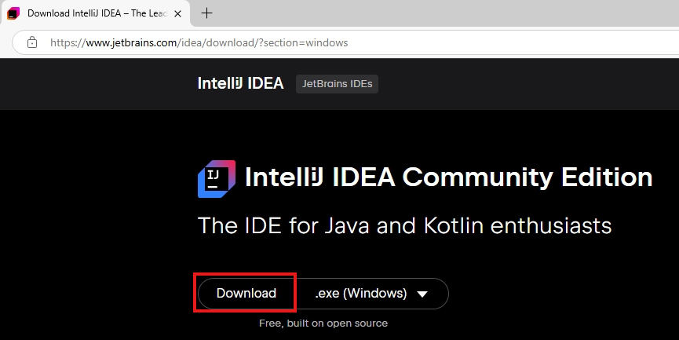
  - Mở file cài đặt và làm theo hướng dẫn trên màn hình để hoàn tất quá trình cài đặt
  - Thực hiện cấu hình cơ bản: Khi cài đặt xong, bạn có thể chọn giao diện (sáng hoặc tối) và cài đặt các plugin cần thiết
  - Tạo dự án Java mới: Nhấn vào "New Project" và chọn ngôn ngữ lập trình Java.
    - 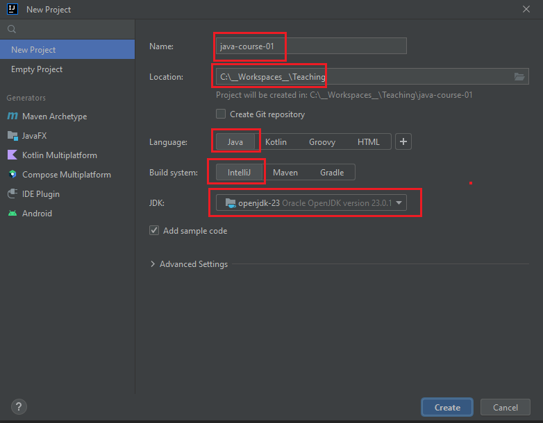

### Cài đặt JDK
- **Dùng IntelliJ để install JDK (khuyến khích)**
  - Các bước:
    - 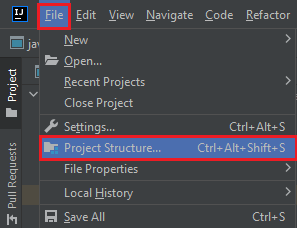
    - 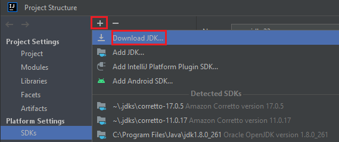
    - 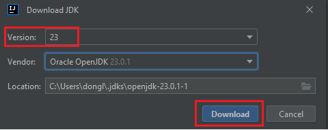
- **Tự install**
  - Bước 1: Truy cập trang web chính thức của Java
    Truy cập trang web chính thức của Oracle để tải về Java Development Kit (JDK) từ địa chỉ: https://www.oracle.com/vn/java/technologies/downloads/#jdk23-windows 
    - 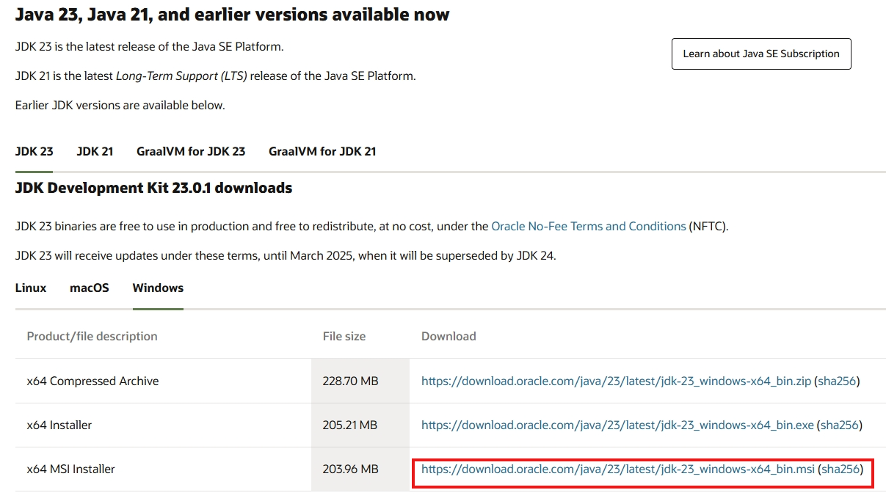
  - Bước 2: Tải về JDK
    Chọn phiên bản JDK phù hợp với hệ điều hành của bạn và nhấn vào nút tải về.
  - Bước 3: Chạy file cài đặt
    Mở file cài đặt JDK đã tải về và làm theo hướng dẫn trên màn hình.
  - Bước 4: Thiết lập môi trường
    Sau khi cài đặt xong, bạn cần thiết lập biến môi trường (Environment Variables) để hệ điều hành nhận diện địa chỉ của Java.
    Mở Control Panel và chọn System and Security.
    Chọn System.
    Nhấp vào Advanced system settings.
    Trong tab Advanced, nhấp vào Environment Variables.
    Trong phần System variables, nhấp đúp vào Path và thêm đường dẫn đến thư mục bin của JDK (ví dụ: C:\Program Files\Java\jdk-15\bin).
    - 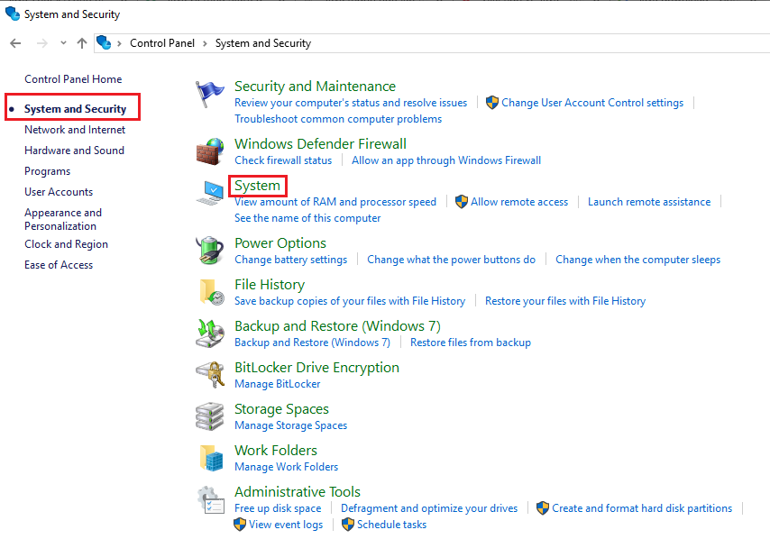
    - 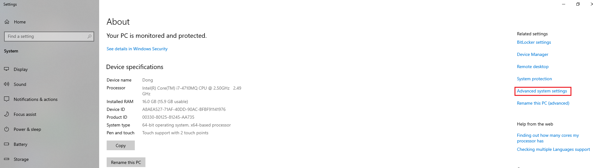
    - 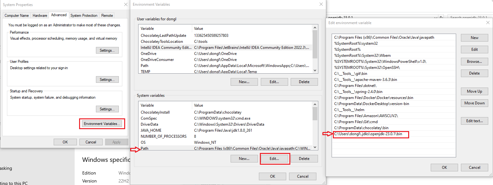
  - Bước 5: Kiểm tra cài đặt
    Mở Command Prompt (hoặc Terminal trên macOS/Linux) và nhập lệnh sau để kiểm tra xem Java đã được cài đặt thành công hay chưa:
      - 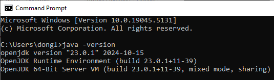

### Chương trình đầu tiên: Hello world
- Bước 1: Tạo một Java file và đặt tên là `Main.java`.
  - 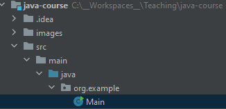
- Bước 2: Viết Java source code cơ bản:
  ```java
  public class Main {
      public static void main(String[] args) {
          System.out.println("Hello, World!");
      }
  }
  ```
- Bước 3: Chạy code
  - 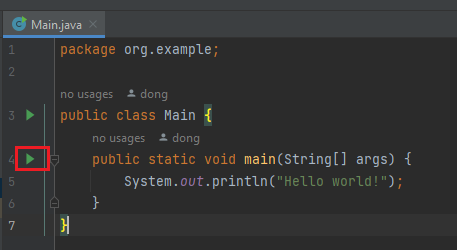
- Bước 4: Kiểm tra kết quả
  - 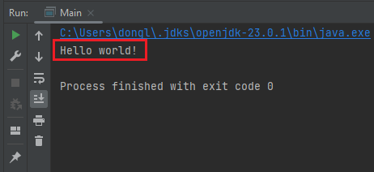


## 3. Quản lý source code với Git - Github
### Git vs. Github

| **Tiêu chí**        | **Git**                                                                 | **GitHub**                                                |
|----------------------|-------------------------------------------------------------------------|-----------------------------------------------------------|
| **Khái niệm**       | Hệ thống kiểm soát phiên bản phân tán, giúp quản lý lịch sử thay đổi mã nguồn. | Nền tảng lưu trữ trực tuyến và quản lý repository dựa trên Git. |
| **Chức năng chính** | Theo dõi và quản lý thay đổi trong mã nguồn trên máy tính cục bộ hoặc hệ thống từ xa. | Lưu trữ, chia sẻ repository và hỗ trợ làm việc nhóm qua các công cụ cộng tác. |
| **Phạm vi sử dụng** | Hoạt động cục bộ hoặc trên các máy chủ từ xa.                           | Chỉ hoạt động trên nền tảng trực tuyến hoặc thông qua ứng dụng GitHub. |
| **Cách sử dụng**    | Sử dụng thông qua dòng lệnh, GUI (Giao diện đồ họa), hoặc công cụ tích hợp trong IDE. | Truy cập qua trình duyệt web, ứng dụng desktop, hoặc API. |
| **Mối quan hệ**     | Là công cụ cơ bản để theo dõi và kiểm soát phiên bản.                  | Dựa trên Git để cung cấp các tính năng nâng cao và cộng tác. |
| **Tính năng nổi bật**| Hỗ trợ quản lý phiên bản, hợp nhất (merge), nhánh (branch).           | Hỗ trợ pull request, code review, issue tracking, CI/CD, và wiki. |
| **Chi phí**         | Miễn phí, mã nguồn mở.                                                | Miễn phí cho repository public, có gói trả phí cho repository private và tính năng nâng cao. |
| **Lưu trữ dữ liệu** | Lưu trữ trên máy cục bộ hoặc máy chủ bất kỳ do người dùng cấu hình.    | Lưu trữ trên máy chủ của GitHub (github.com).             |

### Làm việc với Git - Github

#### Bước 1: Tạo tài khoản GitHub
1. Truy cập trang web [github.com](https://github.com) và nhấn vào nút **Sign up**.
2. Nhập thông tin cá nhân của bạn bao gồm địa chỉ email, mật khẩu, và tên người dùng. 
3. Xác nhận email của bạn thông qua email mà GitHub gửi đến.
4. Hoàn thành các bước hướng dẫn còn lại để thiết lập tài khoản của bạn.
5. upload ssh key

Xem thêm video hướng dẫn chi tiết tại đây: [Link](https://www.youtube.com/watch?v=MWKOBfB8I2s)

#### Bước 2: Thiết lập Git trên máy tính
1. Tải và cài đặt Git từ trang web [git-scm.com](https://git-scm.com).
2. Sau khi cài đặt, mở terminal (hoặc Command Prompt trên Windows).
3. Cấu hình thông tin người dùng của bạn:
   ```bash
   git config --global user.name "Tên của bạn"
   git config --global user.email "email@example.com"
4. Khởi tạo repository ở local và đẩy code lên repository trên github
```bash
git init
git add .
git commit -m "First commit"
git remote add origin <repository-url>
git push -u origin <branch-name>
```

## 4. Tổng hợp những điểm cần nhớ
- Java là một ngôn ngữ lập trình mạnh mẽ, hướng đối tượng, được thiết kế để viết một lần, chạy mọi nơi (Write Once, Run Anywhere - WORA).
- Bắt đầu với Java yêu cầu thiết lập JDK, một IDE (như IntelliJ IDEA, Eclipse, hoặc NetBeans), và hiểu cơ bản về cú pháp của ngôn ngữ.
- Sử dụng Git và GitHub để quản lý mã nguồn giúp theo dõi thay đổi, làm việc nhóm hiệu quả và tích hợp quy trình phát triển phần mềm.

## 5. Bài tập

### 5.1. Bài tập trắc nghiệm
1. Java là loại ngôn ngữ nào?
   - a. Thủ tục (Procedural)
   - b. Hướng đối tượng (Object-Oriented)
   - c. Lập trình hàm (Functional Programming)
   - d. Scripting

2. Công cụ nào dưới đây được sử dụng để biên dịch mã nguồn Java thành bytecode?
   - a. JVM
   - b. JDK
   - c. JRE
   - d. javac

3. Tính năng chính của GitHub là gì?
   - a. Quản lý bộ nhớ của JVM
   - b. Lưu trữ và quản lý mã nguồn
   - c. Biên dịch chương trình
   - d. Tối ưu hiệu năng mã nguồn

### 5.2. Bài tập thực hành
1. **Thiết lập môi trường lập trình Java:**
   - Cài đặt JDK trên máy tính của bạn.
   - Cài đặt một IDE (như IntelliJ IDEA, Eclipse, hoặc NetBeans).
   - Viết chương trình Java đầu tiên in ra dòng chữ: `Hello, World!`.

   **Ví dụ:**
   ```java
   public class Main {
       public static void main(String[] args) {
           System.out.println("Hello, World!");
       }
   }

2. **Sử dụng Git và GitHub:**
- Tạo một repository mới trên GitHub.
- Clone repository về máy cục bộ.
- Thêm file mã nguồn Java ở trên vào repository và commit thay đổi.
- Đẩy (push) mã nguồn lên GitHub.
