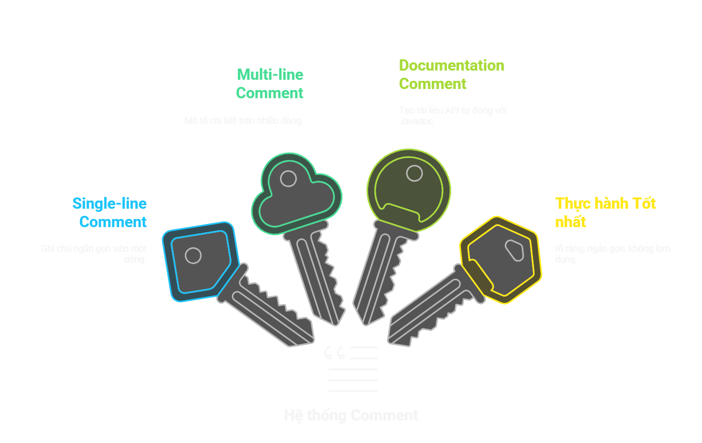

# Java Comment: Giới thiệu và cách sử dụng

## Tổng quan bài học
- Comment là gì, 3 loại comment
- Tại sao comment quan trọng trong kiểm thử

## Nội dung bài học

**1. Giới thiệu chung**

**2. 3 loại comment trong Java**

**3. Vai trò của comment trong kiểm thử**

**4. Một số lưu ý**

**5. Tổng hợp những điểm cần nhớ**

**6. Bài tập**

---

## 1. Giới thiệu chung
- Comment trong Java: Đoạn code mà trình biên dịch bỏ qua.
- Mục đích: Giải thích code, hỗ trợ debug (bỏ qua đoạn logic tạm thời), tạo tài liệu tự động.

## 2. 3 loại comment trong Java

### Single-line Comment
- Sử dụng `//` để ghi chú trên một dòng.
```java
// Đây là một comment dòng đơn
System.out.println("Hello, World!"); // Ghi chú ngắn gọn
```

### Multi-line Comment
- Sử dụng `/* ... */` để ghi chú trên nhiều dòng.
- Mô tả logic dài hoặc giải thích khối code.
```java
/*
   Đây là một comment nhiều dòng.
   Dùng để giải thích hoặc mô tả logic dài.
*/
System.out.println("Hello, World!");
```

### Documentation Comment (Javadoc Comment)
- Sử dụng `/** ... */` để tạo comment tài liệu.
- Dùng để tạo tài liệu API tự động bằng công cụ Javadoc.
- Ví dụ:
```java
/**
 * Lớp HelloWorld dùng để hiển thị thông điệp ra màn hình.
 */
public class HelloWorld {
    /**
     * Phương thức main là điểm bắt đầu của chương trình.
     * @param args Các tham số dòng lệnh
     */
    public static void main(String[] args) {
        System.out.println("Hello, World!"); // In ra thông điệp
    }
}
```
### Tạo tài liệu với javadoc
```bash
javadoc -d out/doc .\lesson02\CommentSample.java
```

## 3. Vai trò của comment trong kiểm thử
### Giải thích mục đích và điều kiện kiểm thử
```java
@Test
public void testLogin() {
    // Kiểm tra nếu tài khoản admin có thể đăng nhập với mật khẩu hợp lệ
    assertTrue(authenticate("admin", "password123"));
}
```
### Hỗ trợ bảo trì và cập nhật test case
```java
@Test
public void testGetUserProfile() {
    // TODO: Cập nhật endpoint từ /api/v1/user -> /api/v2/user khi API mới được triển khai
    String response = callApi("/api/v1/user", "GET");
    assertNotNull(response);
}
```
### Cải thiện readability cho test automation
```java
@Test
public void testLoginUI() {
    // Mở trang đăng nhập
    driver.get("https://example.com/login");

    // Nhập tên người dùng
    driver.findElement(By.id("username")).sendKeys("admin");

    // Nhập mật khẩu
    driver.findElement(By.id("password")).sendKeys("password123");

    // Nhấn nút đăng nhập
    driver.findElement(By.id("loginButton")).click();

    // Kiểm tra nếu trang chính được hiển thị
    assertTrue(driver.getCurrentUrl().contains("/dashboard"));
}
```

## 4. Một số lưu ý khi sử dụng comment
🚀 Comment đúng chỗ = Dễ đọc, dễ bảo trì, và giúp kiểm thử hiệu quả hơn! 🚀

### Chỉ comment khi cần thiết
   ```java
   int x = 10; // Gán giá trị 10 cho x
   ```

### Viết comment rõ ràng và ngắn gọn
   - Comment phải giải thích "tại sao" hơn là "cái gì".
   ```java
   // Tính tổng các số từ 1 đến N => WHAT - BAD
   // Sử dụng công thức Gauss để tối ưu => WHY - GOOD
   int sum = (n * (n + 1)) / 2;

   ```

### Cập nhật comment khi source code thay đổi

## 5. Tổng hợp những điểm cần nhớ



## 6. Bài tập

### 6.1. Bài tập trắc nghiệm

1. Comment nào dưới đây là một Documentation Comment?
   - a. `// Đây là một dòng chú thích`
   - b. `/* Đây là một khối chú thích */`
   - c. `/** Đây là một chú thích tài liệu */`
   - d. `// Đây là một chú thích lỗi`

2. Khi nào nên sử dụng Multi-line Comment?
   - a. Khi ghi chú ngắn gọn.
   - b. Khi giải thích một logic phức tạp.
   - c. Khi tạo tài liệu API.
   - d. Khi ghi chú lỗi.

### 6.2. Bài tập thực hành
1. Thêm comment thích hợp vào đoạn source code sau để giải thích chỗ cần thiết
```java
public class EmployeeSalaryCalculator {
   public static double calculateNetSalary(double baseSalary, double taxRate) {
      return baseSalary * (1 - taxRate);
   }

   public static void main(String[] args) {
      double salary = 5000;
      double tax = 0.1;
      double netSalary = calculateNetSalary(salary, tax);
      System.out.println("Lương sau thuế: " + netSalary);
   }
}
```

2. Tạo Javadoc comment cho class và method trên
3. Sử dụng Javadoc để tạo tài liệu cho class và method ở trên

   
