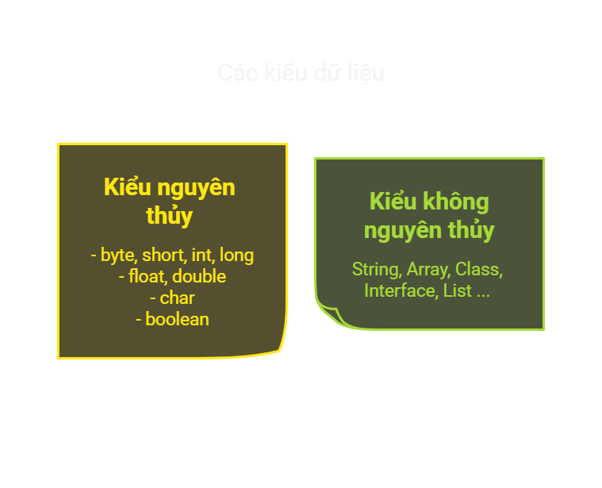
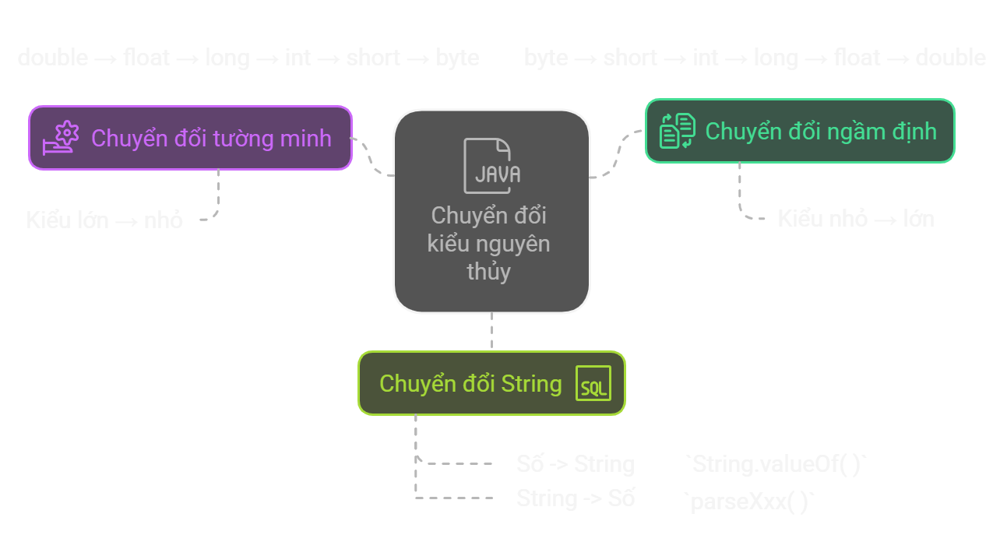
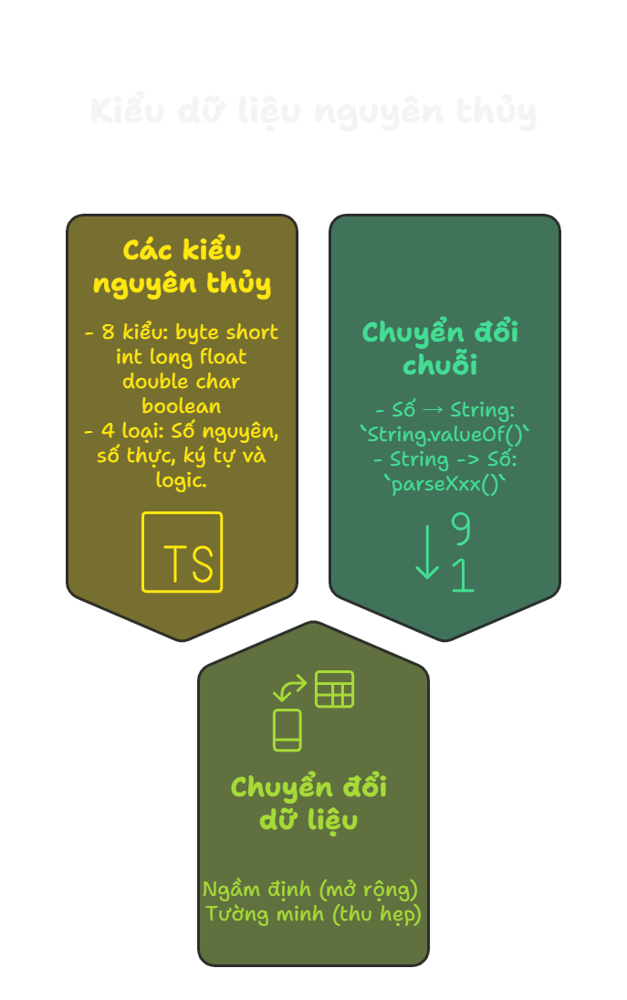

# Các kiểu dữ liệu cơ bản trong Java

## Tổng quan bài học
- Kiểu dữ liệu xác định loại giá trị biến có thể lưu
- 2 nhóm chính:



## Nội dung bài học

### Mục lục

**1. Kiểu dữ liệu nguyên thủy**

**2. Chuyển đổi kiểu dữ liệu**

**3. Tổng hợp những điểm cần nhớ**

**4. Bài tập**

## 1. Kiểu dữ liệu nguyên thủy

| **Nhóm**      | **Kiểu dữ liệu**  | **Kích thước** | **Phạm vi giá trị** | **Ví dụ** |
|--------------|------------------|--------------|----------------------------|----------|
| **Số nguyên** | `byte`  | 1 byte  | -128 đến 127 | `byte a = 100;` |
|              | `short` | 2 byte  | -32,768 đến 32,767 | `short b = 20000;` |
|              | `int`   | 4 byte  | -2³¹ đến 2³¹-1 | `int c = 100000;` |
|              | `long`  | 8 byte  | -2⁶³ đến 2⁶³-1 | `long d = 10000000000L;` |
| **Số thực**  | `float`  | 4 byte  | ±3.4 × 10³⁸ | `float e = 3.14f;` |
|              | `double` | 8 byte  | ±1.8 × 10³⁰⁸ | `double f = 3.14159;` |
| **Ký tự**    | `char`  | 2 byte  | 0 đến 65,535 (Unicode) | `char g = 'A';` |
| **Logic**    | `boolean` | Không xác định | `true` hoặc `false` | `boolean h = true;` |

```java
int age = 25;
float height = 5.8f;
char gender = 'M';
boolean isStudent = true;
```

## 2. Chuyển đổi kiểu dữ liệu
**Xảy ra khi cần thay đổi kiểu của biến**


### Chuyển đổi ngầm định (Implicit Casting - Widening)
✅ Kiểu nhỏ → lớn, không cần ép kiểu

📌 Không bị mất dữ liệu vì kiểu lớn có thể chứa được kiểu nhỏ
```java
int num = 100;
double bigNum = num; // Chuyển từ int sang double
System.out.println(bigNum); // Output: 100.0
```
### Chuyển đổi tường minh (Explicit Casting - Narrowing)
✅ Kiểu lớn → nhỏ, cần ép kiểu bằng dấu ( )

📌 Có thể mất dữ liệu
```java
double pi = 3.14159;
int intPi = (int) pi; // Chuyển từ double sang int
System.out.println(intPi); // Output: 3 (mất phần thập phân)
```
### Chuyển đổi giữa kiểu nguyên thủy và String
✅ Chuyển từ số sang String
```java
int number = 42;
String text = String.valueOf(number);
System.out.println(text); // Output: "42"
```
✅ Chuyển từ String sang số
```java
String str = "123";
int num = Integer.parseInt(str);
System.out.println(num + 10); // Output: 133
```

## 3. Tổng hợp những điểm cần nhớ


---

## 4. Bài tập

### Bài tập trắc nghiệm

**Câu 1:** Kiểu dữ liệu nào trong Java có kích thước **4 byte**?  
- A. `byte`  
- B. `short`  
- C. `int`  
- D. `long`  

---

**Câu 2:** Kiểu dữ liệu nào chỉ có thể lưu giá trị `true` hoặc `false`?  
- A. `int`  
- B. `char`  
- C. `boolean`  
- D. `byte` 

---

**Câu 3:** Giá trị nào **hợp lệ** khi gán cho biến kiểu `char`?  
- A. `'A'`  
- B. `"A"`  
- C. `65`  
- D. `true`  

---

### **Câu 4:** Điều gì xảy ra khi ép kiểu `double` sang `int` bằng cách `int x = (int) 3.9;`?  
- A. Lỗi biên dịch  
- B. Kết quả là `4`  
- C. Kết quả là `3`  
- D. Lỗi thời gian chạy

### Bài tập thực hành
**Bài 1:** Viết chương trình khai báo và in ra giá trị của tất cả 8 kiểu dữ liệu nguyên thủy trong Java

---

**Bài 2:** Viết chương trình thực hiện ép kiểu tường minh và ép kiểu ngầm định với các kiểu dữ liệu sau:
- Chuyển `double` sang `int`
- Chuyển `int` sang `double`
- Chuyển `char` sang `int`
- Chuyển `int` sang `char`