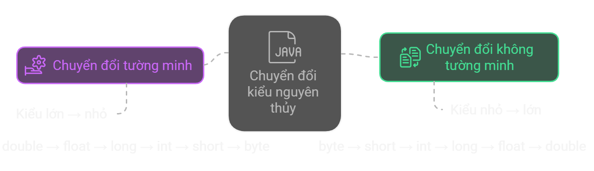

# Các kiểu dữ liệu cơ bản trong Java

## Tổng quan bài học
- Kiểu dữ liệu xác định **loại giá trị** biến và hằng có thể lưu.
- Có 2 kiểu dữ liệu: **Kiểu nguyên thuỷ (primitive)** và **kiểu không nguyên thủy (non-primitive)**.
- Trong bài này, chúng ta sẽ tập trung tìm hiểu về **kiểu nguyên thuỷ**.


## Nội dung bài học
**1. Kiểu dữ liệu nguyên thủy**

**2. Chuyển đổi kiểu dữ liệu**

**3. Những thực hành tốt nhất**

**4. Tổng hợp những điểm cần nhớ**

**5. Bài tập**

## 1. Kiểu dữ liệu nguyên thủy

| **Nhóm**      | **Kiểu dữ liệu**  | **Kích thước** | **Phạm vi giá trị** | **Ví dụ** |
|--------------|------------------|--------------|----------------------------|----------|
| **Số nguyên** | `byte`  | 1 byte  | -128 đến 127 | `byte a = 100;` |
|              | `short` | 2 byte  | -32,768 đến 32,767 | `short b = 20000;` |
|              | `int`   | 4 byte  | -2³¹ đến 2³¹-1 | `int c = 100000;` |
|              | `long`  | 8 byte  | -2⁶³ đến 2⁶³-1 | `long d = 10000000000L;` |
| **Số thực**  | `float`  | 4 byte  | ±3.4 × 10³⁸ | `float e = 3.14f;` |
|              | `double` | 8 byte  | ±1.8 × 10³⁰⁸ | `double f = 3.14159;` |
| **Ký tự**    | `char`  | 2 byte  | 0 đến 65,535 (Unicode) | `char g = 'A';` |
| **Logic**    | `boolean` | Không xác định | `true` hoặc `false` | `boolean h = true;` |

```java
int age = 25;
char gender = 'M';
boolean isStudent = true;
float pi = 3.14f;
double precisePi = 3.141592653589793;
```

## 2. Chuyển đổi kiểu dữ liệu
**Xảy ra khi cần thay đổi kiểu của biến**


### Chuyển đổi không tường minh (Implicit Casting - Widening)
✅ Kiểu nhỏ → lớn, không cần ép kiểu    
📌 Không bị mất dữ liệu vì kiểu lớn có thể chứa được kiểu nhỏ
```java
int num = 100;
double bigNum = num; // Chuyển từ int sang double
System.out.println(bigNum); // Output: 100.0
```
### Chuyển đổi tường minh (Explicit Casting - Narrowing)
✅ Kiểu lớn → nhỏ, cần ép kiểu bằng dấu ( )     
📌 Có thể mất dữ liệu
```java
double pi = 3.14159;
int intPi = (int) pi; // Chuyển từ double sang int
System.out.println(intPi); // Output: 3 (mất phần thập phân)
```

## 3. Những thực hành tốt nhất
### Chọn kiểu dữ liệu phù hợp để tối ưu bộ nhớ
- **Dùng `byte`, `short`, `int`, `long`** cho số nguyên: Chọn kiểu dữ liệu nhỏ nhất có thể.  
- **Dùng `float`, `double`** cho số thực, nhưng `double` có độ chính xác cao hơn.  
- **Dùng `boolean`** khi chỉ cần giá trị `true` hoặc `false`.  
- **Dùng `char`** để lưu trữ ký tự Unicode.
```java
byte age = 25;       // Thay vì dùng int nếu phạm vi nhỏ
long population = 7_800_000_000L; // Cần hậu tố 'L' để xác định kiểu long
float price = 9.99f; // Cần hậu tố 'f' cho float
```

### Chú ý phạm vi giá trị của kiểu dữ liệu
- Mỗi kiểu nguyên thủy có **phạm vi giá trị cố định**.
- Nếu vượt quá phạm vi: **Lỗi biên dịch**.
- Java không cảnh báo **lỗi tràn số (overflow)** với kiểu nguyên thủy, giá trị sẽ bị **"quay vòng" (wrap around)**.
```java
short salary = 40000; // ❌ Lỗi: short chỉ chứa giá trị từ -32,768 đến 32,767
byte numberOfBoxes = 200;    // ❌ Lỗi: byte chỉ chứa giá trị từ -128 đến 127
// ✅ Dùng int thay vì short
int numberOfPeople = 40000; // Dùng int thay vì short
// ❌ Ví dụ về giá trị bị quay vòng
byte x = 127; // Giá trị lớn nhất của byte
x += 1;
System.out.println(x); // ❌ Output: -128 (do tràn số)
```

### Cẩn thận khi ép kiểu (Casting)
- Khi chuyển đổi kiểu dữ liệu **lớn sang nhỏ**, cần **ép kiểu tường minh** để tránh mất dữ liệu.
- Chuyển đổi từ `double` sang `int` sẽ làm **mất phần thập phân**.
```java
double pi = 3.14159;
int intPi = (int) pi; // Mất phần thập phân
System.out.println(intPi); // Output: 3
```

### Giá trị mặc định của kiểu nguyên thủy
Biến cục bộ (local variable):
- **Không có** giá trị mặc định.
- Phải được **khởi tạo trước** khi sử dụng.
```java
public class Main {
    public static void main(String[] args) {
        int x;  
        System.out.println(x); // ❌ Lỗi: x chưa được khởi tạo
    }
}
```

## 4. Tổng hợp những điểm cần nhớ


## 5. Bài tập

### 10 Câu hỏi trắc nghiệm

**Câu 1:** Kiểu dữ liệu nào trong Java có kích thước **4 byte**?  
- A. `byte`  
- B. `short`  
- C. `int`  
- D. `long`  

**Câu 2:** Kiểu dữ liệu nào chỉ có thể lưu giá trị `true` hoặc `false`?  
- A. `int`  
- B. `char`  
- C. `boolean`  
- D. `byte` 

**Câu 3:** Giá trị nào **hợp lệ** khi gán cho biến kiểu `char`?  
- A. `'A'`  
- B. `"A"`  
- C. `65`  
- D. `true`  

**Câu 4:** Điều gì xảy ra khi ép kiểu `double` sang `int` bằng cách `int x = (int) 3.9;`?  
- A. Lỗi biên dịch  
- B. Kết quả là `4`  
- C. Kết quả là `3`  
- D. Lỗi thời gian chạy

**Câu 5:** Câu lệnh nào sau đây đúng cú pháp khi khai báo biến kiểu `float`?
- A. `float x = 5.5;`  
- B. `float x = 5.5f;`  
- C. `float x = 5;`  
- D. Cả B và C đều đúng 

**Câu 6:** Chuyển đổi kiểu dữ liệu từ `int` sang `double` được gọi là gì?
- A. Explicit Casting  
- B. Narrowing  
- C. Implicit Casting  
- D. Type Overflow  

**Câu 7:** Phạm vi giá trị của kiểu `short` là gì?
- A. -128 đến 127  
- B. -32,768 đến 32,767  
- C. -2³¹ đến 2³¹-1  
- D. 0 đến 65,535  

**Câu 8:** Kiểu dữ liệu `char` trong Java có kích thước bao nhiêu byte?
- A. 1 byte
- B. 2 byte
- C. 4 byte
- D. 8 byte

**Câu 9:** Câu lệnh nào sau đây sẽ gây **lỗi biên dịch**?
- A. byte b = 100;
- B. short s = 40000;
- C. char c = 'A';
- D. long l = 50000L;

**Câu 10:** Trong chuyển đổi kiểu dữ liệu, khi nào có thể xảy ra **mất dữ liệu**?
- A. Khi chuyển từ kiểu nhỏ sang kiểu lớn
- B. Khi chuyển từ kiểu lớn sang kiểu nhỏ
- C. Khi chuyển từ int sang long
- D. Khi chuyển từ boolean sang int

### Bài tập thực hành

**Bài 1:** Viết một đoạn code Java sử dụng tất cả 8 kiểu dữ liệu nguyên thủy (`byte`, `short`, `int`, `long`, `float`, `double`, `char`, `boolean`). In giá trị của các biến này ra màn hình.
Gợi ý: Đảm bảo giá trị nằm trong phạm vi cho phép của từng kiểu.

**Bài 2:** Giải thích sự khác biệt giữa Implicit Casting và Explicit Casting. Hãy viết hai đoạn code minh họa: một cho Implicit Casting từ int sang double, và một cho Explicit Casting từ double sang int.
Gợi ý: Bao gồm kết quả đầu ra và giải thích tại sao có sự thay đổi (nếu có).

**Bài 3:** Mô tả sự khác biệt giữa kiểu dữ liệu `float` và `double` trong Java. Hãy đưa ra ví dụ minh họa cho từng kiểu.
Gợi ý: Tập trung vào kích thước, phạm vi giá trị, và cách khai báo.

**Bài 4:** Cho đoạn code sau:
```java
double a = 123.456;
int b = (int) a;
System.out.println("a = " + a);
System.out.println("b = " + b);
```
Hãy phân tích kết quả đầu ra của đoạn code trên và giải thích tại sao giá trị của `b` lại như vậy.

**Bài 5:** Viết chương trình yêu cầu người dùng nhập một số nguyên từ bàn phím (kiểu int), sau đó chuyển đổi số đó sang kiểu `float` và `double`, rồi in cả ba giá trị ra màn hình. 
**Gợi ý 1:** Sử dụng lớp Scanner.
**Gợi ý 2:** Đảm bảo chương trình xử lý đầu vào hợp lệ và hiển thị rõ ràng từng kiểu dữ liệu.

