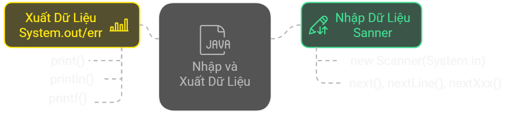

# Nhập và xuất dữ liệu trong Java

## Tổng quan bài học
✅ Biết các cách để xuất và nhập dữ liệu ra màn hình  
✅ Tập trung:
- Nhập dữ liệu từ keyboard với Scanner
- Xuất dữ liệu với System.out/err

## Nội dung bài học

**1. Nhập dữ liệu với Scanner**

**2. Xuất dữ liệu với System.out/err**

**3. Tổng hợp những điểm cần nhớ**

**4. Bài tập**

## 1. Nhập dữ liệu với Scanner
- Có nhiều cách nhập dữ liệu: Scanner (keyboard), BufferedReader (keyboard), Console (CLI), FileReader (File) ...
- Scanner là cách đơn giản nhất
- Thuộc package `java.util`, hỗ trợ nhập số, chuỗi, boolean ...

### Các phương thức phổ biến của `Scanner`
- `next()`: Đọc 1 từ
- `nextLine()`: Đọc cả dòng
- `nextXxx()`: Đọc các số có kiểu nguyên thủy hoặc boolean


| **Phương thức** | **Kiểu dữ liệu đọc vào** | **Mô tả** | **Ví dụ** |
|---------------|------------------|-----------|-----------|
| `nextInt()` | `int` | Đọc một số nguyên | `int age = scanner.nextInt();` |
| `nextDouble()` | `double` | Đọc một số thực (dấu chấm động) | `double price = scanner.nextDouble();` |
| `nextBoolean()` | `boolean` | Đọc giá trị `true` hoặc `false` | `boolean isJavaFun = scanner.nextBoolean();` |
| `next()` | `String` | Đọc một từ (chuỗi không chứa khoảng trắng) | `String name = scanner.next();` |
| `nextLine()` | `String` | Đọc cả dòng (bao gồm khoảng trắng) | `String fullName = scanner.nextLine();` |
| `nextByte()` | `byte` | Đọc số kiểu `byte` | `byte smallNumber = scanner.nextByte();` |
| `nextShort()` | `short` | Đọc số kiểu `short` | `short shortNumber = scanner.nextShort();` |
| `nextLong()` | `long` | Đọc số kiểu `long` | `long bigNumber = scanner.nextLong();` |
| `nextFloat()` | `float` | Đọc số kiểu `float` | `float pi = scanner.nextFloat();` |

```java
import java.util.Scanner;

public class ScannerExample {
    public static void main(String[] args) {
        Scanner scanner = new Scanner(System.in); // Tạo đối tượng Scanner

        System.out.print("Nhập tên của bạn: ");
        String name = scanner.nextLine(); // Đọc cả dòng

        System.out.print("Nhập tuổi của bạn: ");
        int age = scanner.nextInt(); // Đọc số nguyên

        System.out.print("Nhập điểm trung bình: ");
        double score = scanner.nextDouble(); // Đọc số thực

        System.out.println("Xin chào, " + name + "! Bạn " + age + " tuổi, điểm trung bình: " + score);

        scanner.close(); // Đóng Scanner để giải phóng tài nguyên
    }
}
```

### Lưu ý
- Luôn đóng `scanner.close();` sau khi sử dụng.
- Dùng `scanner.nextLine()` cẩn thận sau `nextInt()` hoặc `nextDouble()` 
  - Nguyên nhân `nextInt()` và `nextDouble()` chỉ đọc giá trị số và không đọc ký tự xuống dòng (\n) sau khi nhấn Enter.
  - Cách khắc phục: Thêm `scanner.nextLine();` sau khi nhập số.

## 2. Xuất dữ liệu với System.out/err
- `System.out` `System.err`: Đối tượng tĩnh của class PrintStream: In ra console.

### println() và print()
  - `println()`: Hiển thị + xuống dòng.
  - `print()`: Hiển thị + không xuống dòng.
```java
public class Main {
  public static void main(String[] args) {
      System.out.println("Hello, World!"); // Xuất ra và xuống dòng
      System.out.print("This is Java.");  // Xuất ra và không xuống dòng
      System.out.print(" Let's learn!");  // Tiếp tục trên cùng một dòng
  }
}
```

### printf()
- `printf()`: Hiển thị output ra console với định dạng chuẩn, dùng với placeholder

- Có thể dùng `printf()` để căn chỉnh cột

```java
public class Main {
  public static void main(String[] args) {
      int age = 25;
      String name = "John";
      double score = 89.5;
      //In ra console với định dạng
      // Output: Name: John, Age: 25, Score: 89.50
      System.out.printf("Name: %s, Age: %d, Score: %.2f", name, age, score);

      // Căn chỉnh cột
      System.out.printf("%-15s %-10s %-5s%n", "Name", "Age", "Score");
      System.out.printf("%-15s %-10d %-5.1f%n", "Alice", 30, 89.5);
      System.out.printf("%-15s %-10d %-5.1f%n", "Bob", 25, 95.0);
  }
}
```

### Đầu ra lỗi với System.err
- `System.err`: In lỗi hoặc thông báo quan trọng ra console.
- Có thể cấu hình để tách `System.out` và `System.err` (E.g.: ghi `System.err` vào file log).
```java
import java.io.File;
import java.io.FileNotFoundException;
import java.io.PrintStream;

public class SeparateOutputAndError {
    public static void main(String[] args) {
        try {
            // Tạo file log cho error
            File errorLog = new File("error.log");
            PrintStream errorStream = new PrintStream(errorLog);
            
            // Chuyển hướng System.err vào file error.log
            System.setErr(errorStream);

            // In ra console (stdout)
            System.out.println("Đây là thông báo thông thường (System.out)");

            // In lỗi ra file (stderr)
            System.err.println("Đây là thông báo lỗi (System.err)");

            // Đóng stream sau khi sử dụng
            errorStream.close();
        } catch (FileNotFoundException e) {
            System.out.println("Không thể tạo file log: " + e.getMessage());
        }
    }
}
```

## 3. Tổng hợp những điểm cần nhớ


## 4. Bài tập

### 10 câu trắc nghiệm

**Câu 1:** Để sử dụng `Scanner` trong Java, bạn cần import thư viện nào?  
- A. `import java.io.Scanner;`  
- B. `import java.util.Scanner;`  
- C. `import java.lang.Scanner;`  
- D. `import java.Scanner;`  

**Câu 2:** Lệnh nào dưới đây dùng để nhập một số nguyên từ bàn phím?  
- A. `Scanner.nextInt();`  
- B. `Scanner.inputInt();`  
- C. `Scanner.readInt();`  
- D. `Scanner.getInt();`  

**Câu 3:** Khi nào cần sử dụng `scanner.nextLine()` thay vì `scanner.next()`?  
- A. Khi nhập một chuỗi không chứa khoảng trắng  
- B. Khi nhập một số nguyên  
- C. Khi nhập cả một dòng văn bản có khoảng trắng  
- D. Khi nhập một số thực

**Câu 4:** Phương thức nào dưới đây dùng để nhập một số thực (`double`) từ bàn phím?  
- A. `scanner.nextDouble();`  
- B. `scanner.readDouble();`  
- C. `scanner.getDouble();`  
- D. `scanner.inputDouble();`  

**Câu 5:** Khi sử dụng `scanner.nextInt()` để nhập số nguyên, tại sao cần gọi `scanner.nextLine()` ngay sau đó?  
- A. Để làm sạch bộ đệm và tránh lỗi khi nhập tiếp chuỗi  
- B. Để lưu giá trị số nguyên vào biến  
- C. Để chương trình chạy nhanh hơn  
- D. Không cần thiết  

**Câu 6:** Lệnh nào dưới đây giúp xuất dữ liệu mà không xuống dòng?  
- A. `System.out.println();`  
- B. `System.out.print();`  
- C. `System.out.printf();`  
- D. Cả B và C  

**Câu 7:** Trong câu lệnh `System.out.printf("Tuổi: %d", 25);`, `%d` có nghĩa là gì?  
- A. In ra số nguyên  
- B. In ra số thực  
- C. In ra chuỗi  
- D. In ra ký tự  

**Câu 8:** Lệnh nào giúp định dạng số thực với 2 chữ số thập phân?  
- A. `System.out.printf("%.2f", 3.14159);`  
- B. `System.out.printf("%.2d", 3.14159);`  
- C. `System.out.print("%.2f", 3.14159);`  
- D. `System.out.print("%.2d", 3.14159);`  

**Câu 9:** Output của đoạn code sau là gì?  
```java
System.out.print("A");
System.out.println("B");
System.out.print("C");
```
- A. `AB C`
- B. `A B C`
- C. `AB` xuống dòng `C`
- D. `A` xuống dòng `B C`

**Câu 10:** Điều gì xảy ra nếu không đóng `Scanner` sau khi sử dụng?
- A. Gây lỗi biên dịch
- B. Gây rò rỉ bộ nhớ
- C. Không ảnh hưởng gì
- D. Chương trình dừng ngay lập tức

### Bài tập tự luận
**Bài 1: Nhập và xuất thông tin cá nhân**  
Viết chương trình Java cho phép người dùng nhập **họ tên**, **tuổi** và **địa chỉ**, sau đó hiển thị lại thông tin theo mẫu sau:
```bash
Nhập họ tên: Alice Johnson
Nhập tuổi: 25
Nhập địa chỉ: Hà Nội
Xin chào Alice Johnson, bạn 25 tuổi, sống tại Hà Nội.
```
**Yêu cầu:**  
- Dùng `Scanner` để nhập dữ liệu từ bàn phím.  
- Hiển thị kết quả bằng `System.out.println()`.

**Bài 2: Tính tổng hai số nguyên**  
Viết chương trình cho phép người dùng nhập **hai số nguyên**, sau đó tính và in ra **tổng của chúng**.  
```bash
Nhập số thứ nhất: 15
Nhập số thứ hai: 30
Tổng hai số: 45
```
**Yêu cầu:**  
- Dùng `scanner.nextInt()` để nhập số nguyên.  
- Dùng `System.out.printf()` để hiển thị kết quả. 

**Bài 3: Định dạng số thực**  
Viết chương trình nhập **một số thực** từ bàn phím, sau đó hiển thị số đó với **2 chữ số thập phân**.  
```bash
Nhập số thực: 3.14159
Số sau khi định dạng: 3.14
```
**Yêu cầu:**  
- Dùng `scanner.nextDouble()` để nhập số thực.  
- Dùng `System.out.printf("%.2f", number);` để in số với 2 chữ số thập phân. 

**Bài 4: Kiểm tra số chẵn/lẻ**  
Viết chương trình nhập **một số nguyên** từ bàn phím và kiểm tra xem số đó **chẵn hay lẻ**
```bash
Nhập số nguyên: 7
Số 7 là số lẻ.
```
**Yêu cầu:**  
- Dùng toán tử `%` để kiểm tra chẵn/lẻ.  
- Xuất kết quả bằng `System.out.println()`.  

**Bài 5: Tính chu vi và diện tích hình chữ nhật**  
Viết chương trình nhập **chiều dài và chiều rộng** của hình chữ nhật, sau đó tính và hiển thị **chu vi và diện tích**.  
```bash
Nhập chiều dài: 5
Nhập chiều rộng: 3
Chu vi: 16
Diện tích: 15
```
**Yêu cầu:**  
- Công thức **Chu vi = 2 * (dài + rộng)**  
- Công thức **Diện tích = dài * rộng**  
- Dùng `System.out.printf()` để hiển thị kết quả đẹp hơn.  