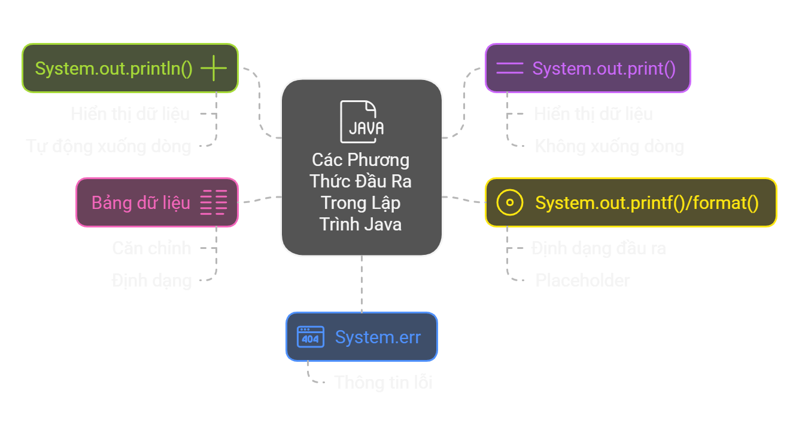

# Xuất dữ liệu ra màn hình trong Java

## Tổng quan bài học
✅ Biết các cách để xuất dữ liệu ra màn hình  
✅ Biết cách định dạng dữ liệu khi in ra màn hình

## Nội dung bài học

### Mục lục
**1. Các cách xuất dữ liệu**

**2. Các thực hành tốt nhất**

**3. Tổng hợp những điểm cần nhớ**

**4. Bài tập**

## 1. Các cách xuất dữ liệu
### 1.1 println() và print()
- `System.out`: Đối tượng tĩnh của class PrintStream: In ra console.
  - `println()`: Hiển thị + xuống dòng.
  - `print()`: Hiển thị + không xuống dòng.
```java
public class Main {
  public static void main(String[] args) {
      System.out.println("Hello, World!"); // Xuất ra và xuống dòng
      System.out.print("This is Java.");  // Xuất ra và không xuống dòng
      System.out.print(" Let's learn!");  // Tiếp tục trên cùng một dòng
  }
}
```

### 1.2 Sử dụng System.out.printf() và System.out.format()
- `printf()` và `format()`: Định dạng chuỗi đầu ra, dùng với placeholder
  - 

```java
public class Main {
  public static void main(String[] args) {
      int age = 25;
      String name = "John";
      double score = 89.5;

      System.out.printf("Name: %s, Age: %d, Score: %.2f", name, age, score);
  }
}
// Output: Name: John, Age: 25, Score: 89.50
```

### 1.3 Kết hợp chuỗi trong output


```java
public class Main {
  public static void main(String[] args) {
      String firstName = "Jane";
      String lastName = "Doe";
      System.out.println("Full Name: " + firstName + " " + lastName);
  }
}
// Output: Full Name: Jane Doe
```

### 1.4 Đầu ra lỗi với System.err
- `System.err`: In lỗi hoặc thông báo quan trọng ra console.
- Có thể cấu hình để tách `System.out` và `System.err` (E.g.: ghi `System.err` vào file log).
```java
public class Main {
  public static void main(String[] args) {
      System.out.println("This is normal output.");
      System.err.println("This is error output.");
  }
}
// Output: 
// This is normal output.
// This is error output.
```

### 1.5 Xuất dữ liệu dạng bảng
- `printf()` hoặc `format()` với placeholder để căn chỉnh cột.
```java
public class Main {
  public static void main(String[] args) {
      System.out.printf("%-15s %-10s %-5s%n", "Name", "Age", "Score");
      System.out.printf("%-15s %-10d %-5.1f%n", "Alice", 30, 89.5);
      System.out.printf("%-15s %-10d %-5.1f%n", "Bob", 25, 95.0);
  }
}
/* Output:
Name            Age       Score
Alice           30        89.5
Bob             25        95.0
*/
```

## 2. Các thực hành tốt nhất


## 3. Tổng hợp những điểm cần nhớ


## 4. Bài tập

### 1. Bài tập trắc nghiệm

1. Đâu là phương thức hiển thị dữ liệu mà không tự động xuống dòng?
   - a. `System.out.println()`
   - b. `System.out.printf()`
   - c. `System.out.print()`
   - d. `System.out.err()`

2. Placeholder nào dùng để hiển thị số thực?
   - a. `%d`
   - b. `%s`
   - c. `%f`
   - d. `%c`

3. Phương thức nào giúp định dạng đầu ra với các placeholder?
   - a. `System.out.println()`
   - b. `System.out.printf()`
   - c. `System.out.print()`
   - d. `System.err()`

### 2. Bài tập thực hành

1. Viết chương trình hiển thị thông tin sau:
   - Tên: John
   - Tuổi: 25
   - Điểm trung bình: 85.5
   - Sử dụng `System.out.printf()` để định dạng.

2. Viết chương trình hiển thị bảng sau bằng `System.out.printf()`:
   ```
   Name            Age       Score
   Alice           30        89.5
   Bob             25        95.0
   ```

3. Sử dụng `System.err` để hiển thị thông báo lỗi: "Error: File not found".
