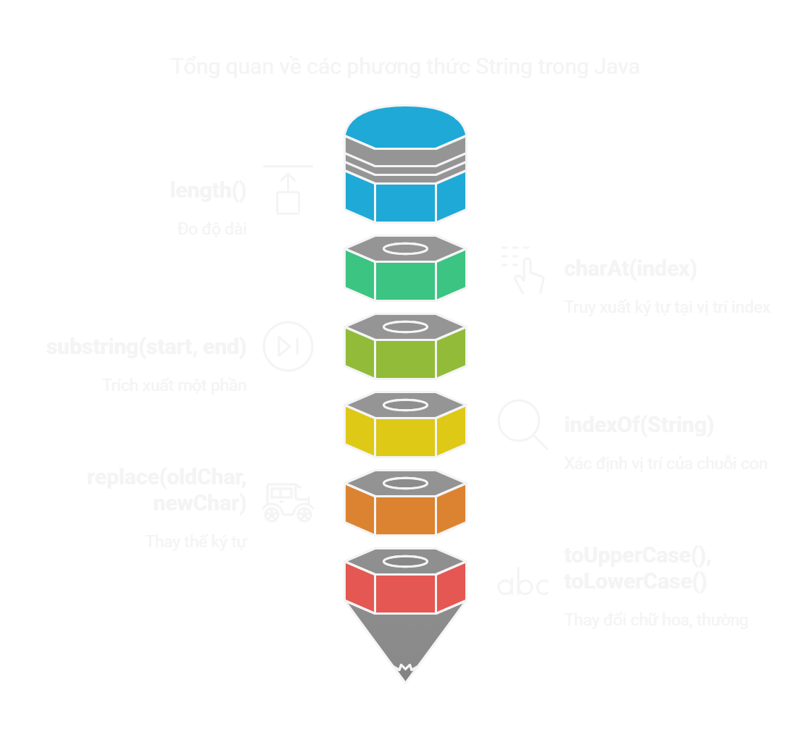

# String trong Java

## Tổng quan bài học
- String: kiểu dữ liệu đặc biệt trong Java. 
- Cách làm việc với String, các tính chất cơ bản, cách xử lý String tối ưu.

## Nội dung bài học

**1.1. Giới thiệu chung**

**1.2. Cách khởi tạo phổ biến**

**1.3. Các phương thức quan trọng**

**1.4. So sánh String**

**1.5. Kết hợp String**

**1.6. Chuyển đổi kiểu dữ liệu nguyên thủy sang String**

**1.7. String Pool và Immutable String**

**1.8. String hỗ trợ Unicode**

**2. Các thực hành tốt nhất**

**3. Tổng hợp những điểm cần nhớ**

**4. Bài tập**

## 1.1. Giới thiệu chung
- `String`: **đối tượng** đại diện cho một chuỗi ký tự.  
- **class `String`** để làm việc với chuỗi, nằm trong package `java.lang`.  
```java
String str = "Hello World";
System.out.println(str); // Output: Hello World
```

## 1.2. Cách khởi tạo phổ biến
| **Cách khởi tạo** | **Ví dụ** | **Ghi chú** |
|------------------|----------|------------|
| **Dùng `""`** | `String s1 = "Hello";` | Dùng **String Pool** -> tối ưu bộ nhớ. |
| **Dùng từ khóa `new`** | `String s2 = new String("Hello");` | Tạo đối tượng mới trên Heap, không dùng **String Pool** (tốn bộ nhớ hơn). |

## 1.3. Các phương thức quan trọng


## 1.4. So sánh String
- Dùng `==` để so sánh tham chiếu (địa chỉ bộ nhớ)
- Dùng .equals() để so sánh nội dung hai String.
```java
String s1 = "Java";
String s2 = new String("Java");

System.out.println(s1 == s2); // false (so sánh địa chỉ bộ nhớ)
System.out.println(s1.equals(s2)); // true (so sánh nội dung)
```

## 1.5. Kết hợp String


```java
String str1 = "Hello";
String str2 = "World";
// 3 cách đều ra kết quả: "Hello, World!"
String result1 = str1 + ", " + str2 + "!";
String result2 = str1.concat(", ").concat(str2).concat("!");
StringBuilder sb = new StringBuilder();
sb.append("Hello");
sb.append(", ");
sb.append("World");
sb.append("!");
String result3 = sb.toString();
```

## 1.6. Chuyển đổi kiểu dữ liệu nguyên thủy sang String
| **Cách thực hiện** | **Ví dụ** |
|------------------|----------|
| Dùng `String.valueOf(value)` | `String str = String.valueOf(123);` |
| Dùng toán tử `+` với String | `String str = 123 + "";` |
```java
int number = 100;
String str1 = String.valueOf(number); // Cách 1
String str2 = number + ""; // Cách 2

System.out.println(str1); // Output: "100"
System.out.println(str2); // Output: "100"
```

## 1.7. String Pool và Immutable String
- String Pool: Khi tạo String bằng `""` -> lưu trữ trong vùng nhớ đặc biệt để tránh trùng lặp.
- Immutable String: String không thể thay đổi nội dung sau khi khởi tạo.
```java
//String pool sample
String a = "Java";
String b = "Java";
System.out.println(a == b); // true (cùng tham chiếu trong String Pool)

String c = new String("Java");
System.out.println(a == c); // false (khác vùng nhớ)

// String immutable sample
String original = "Hello";
String modified = original.concat(" World");

System.out.println(original); // "Hello" (không thay đổi)
System.out.println(modified); // "Hello World"
```

## 1.8. String hỗ trợ Unicode
String xử lý được hầu hết các ngôn ngữ trên thế giới.
```java
String unicode = "こんにちは"; // Chuỗi tiếng Nhật - xin chào
System.out.println(unicode); // Output: こんにちは
```

## 2. Các thực hành tốt nhất

| **Thực hành tốt** | **Mô tả** | **Ví dụ** |
|----------------|-----------|-----------|
| **Dùng `String` thay vì `new String()`** | Tận dụng **String Pool** để tiết kiệm bộ nhớ. | `String str = "Hello";` (✅) <br> `String str = new String("Hello");` (❌ Không cần thiết) |
| **Dùng `StringBuilder` khi cần thay đổi String nhiều lần** | Tránh tạo nhiều đối tượng dư thừa, tối ưu hiệu suất. | `str += i;` (❌ Chậm, tạo nhiều đối tượng) <br> `StringBuilder sb = new StringBuilder(); sb.append("Hello");` (✅) |
| **Dùng `.equals()` để so sánh String** | Không dùng `==` vì nó so sánh tham chiếu. | `s1.equals(s2)` (✅ So sánh nội dung) <br> `s1 == s2` (❌ So sánh tham chiếu) |
| **Dùng `String.format()` hoặc `printf()` khi nối String phức tạp** | Giúp code dễ đọc và gọn hơn. | `String.format("Tên: %s, Tuổi: %d", name, age);` (✅) |
| **Dùng `trim()` để xóa khoảng trắng** | Tránh lỗi khi nhập dữ liệu từ người dùng. | `" Java ".trim();` → `"Java"` (✅) |
| **Dùng `contains()`, `startsWith()`, `endsWith()` thay vì `indexOf()`** | Dễ đọc hơn khi kiểm tra String. | `"Java".contains("av");` (✅) <br> `"Java".indexOf("av") >= 0;` (❌ Dài dòng) |
| **Dùng `equalsIgnoreCase()` thay vì `toLowerCase()` khi so sánh String** | Tối ưu hiệu suất. | `"java".equalsIgnoreCase("Java");` (✅) <br> `"java".toLowerCase().equals("java");` (❌ Không cần thiết) |


## 3. Tổng hợp những điểm cần nhớ


## 4. Bài tập

### 10 câu hỏi trắc nghiệm

**Câu 1: `String` trong Java là gì?**  
- A. Kiểu dữ liệu nguyên thủy  
- B. Một lớp trong Java (`java.lang.String`)  
- C. Một kiểu dữ liệu đặc biệt, không phải lớp cũng không phải nguyên thủy  
- D. Một giao diện (`interface`)  

**Câu 2: Điều gì xảy ra khi chạy đoạn code sau?**  
```java
String s1 = "Hello";
String s2 = "Hello";
System.out.println(s1 == s2);
```
- A. `true`  
- B. `false`  
- C. Lỗi biên dịch  
- D. Lỗi runtime  

**Câu 3: Cách nào tạo `String` mà không dùng String Pool?**  
- A. `String s = "Java";`  
- B. `String s = new String("Java");`  
- C. `String s1 = "Java"; String s2 = "Java";`  
- D. Cả A và C  

**Câu 4: Phương thức nào được dùng để so sánh nội dung của hai chuỗi?**  
- A. `==`  
- B. `equals()`  
- C. `compareTo()`  
- D. Cả B và C  

**Câu 5: Kết quả của đoạn code sau là gì?**  
```java
String str = "  Java Programming  ";
System.out.println(str.trim());
```
- A. `"  Java Programming  "`  
- B. `"Java Programming"`  
- C. `"JavaProgramming"`  
- D. Lỗi biên dịch  

**Câu 6: Phương thức nào giúp kiểm tra chuỗi con trong chuỗi lớn?**  
- A. `contains()`  
- B. `indexOf()`  
- C. `startsWith()`  
- D. Cả A và B  

**Câu 7: Kết quả của đoạn code sau là gì?**  
```java
String str = "Hello";
str.concat(" World");
System.out.println(str);
```
- A. `"Hello World"`  
- B. `"Hello"`  
- C. Lỗi biên dịch  
- D. Lỗi runtime  

**Câu 8: Output của đoạn code sau là gì?**  
```java
String s1 = "Java";
String s2 = "Programming";
System.out.println(s1 + s2);
```
- A. `"Java Programming"`  
- B. `"JavaProgramming"`  
- C. Lỗi biên dịch  
- D. Lỗi runtime  

**Câu 9: Phương thức nào giúp chuyển `"java"` thành `"JAVA"`?**  
- A. `toUpperCase()`  
- B. `toLowerCase()`  
- C. `replace("java", "JAVA")`  
- D. `capitalize()`  

**Câu 10: Điều gì xảy ra nếu bạn sử dụng `==` để so sánh hai chuỗi có cùng giá trị nhưng được tạo bằng `new String()`?**  
- A. `true`  
- B. `false`  
- C. Lỗi biên dịch  
- D. Lỗi runtime  

### Bài tập thực hành  

**Bài 1: Nhập và xuất chuỗi**  
Viết chương trình Java cho phép người dùng nhập một chuỗi và hiển thị lại chuỗi đó.  

**Yêu cầu:** Dùng `Scanner` để nhập và `System.out.println()` để hiển thị.  

**Bài 2: Kiểm tra chuỗi đối xứng**  
Viết chương trình kiểm tra xem một chuỗi có phải là **palindrome** hay không (ví dụ: "madam", "racecar").  

**Gợi ý:** Dùng `StringBuilder` để đảo ngược chuỗi và so sánh bằng `.equals()`.  

**Bài 3: Đếm số lần xuất hiện của một ký tự**  
Viết chương trình nhập một chuỗi và một ký tự từ bàn phím, sau đó đếm số lần xuất hiện của ký tự đó trong chuỗi.  

**Gợi ý:** Dùng vòng lặp `for` và `charAt(i)`.  

**Bài 4: Thay thế chuỗi con**  
Viết chương trình nhập một chuỗi và thay thế tất cả các khoảng trắng bằng dấu gạch dưới (`_`).  

**Gợi ý:** Dùng `replace()` hoặc `replaceAll()`.  

**Bài 5: Tách chuỗi thành mảng từ**  
Viết chương trình nhập một câu và tách các từ trong câu thành một mảng, sau đó in từng từ trên một dòng mới.  

**Gợi ý:** Dùng `split(" ")`.  

