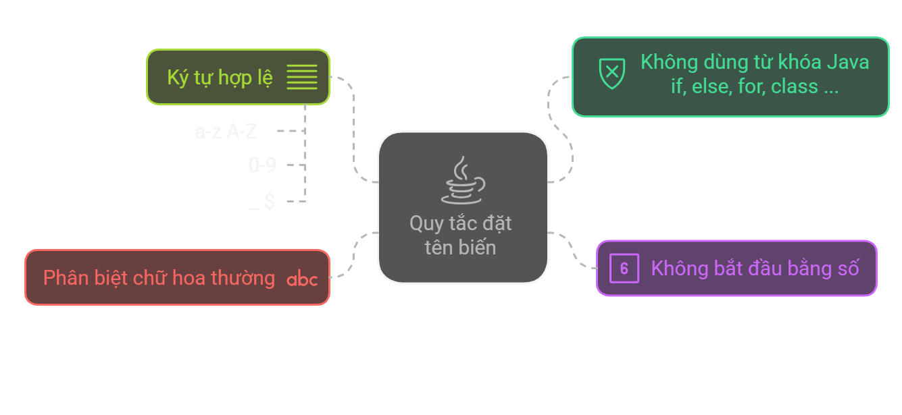
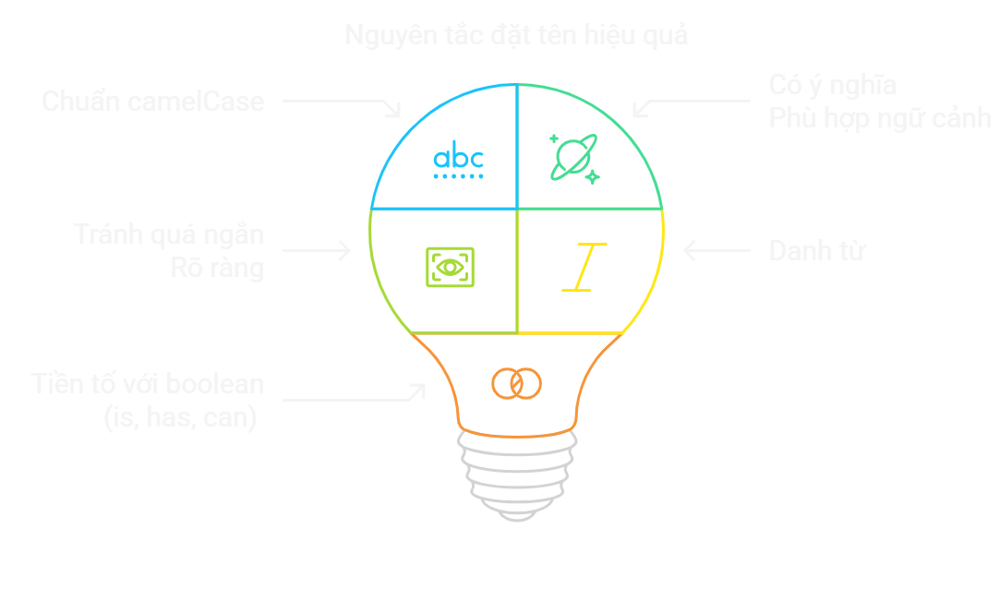
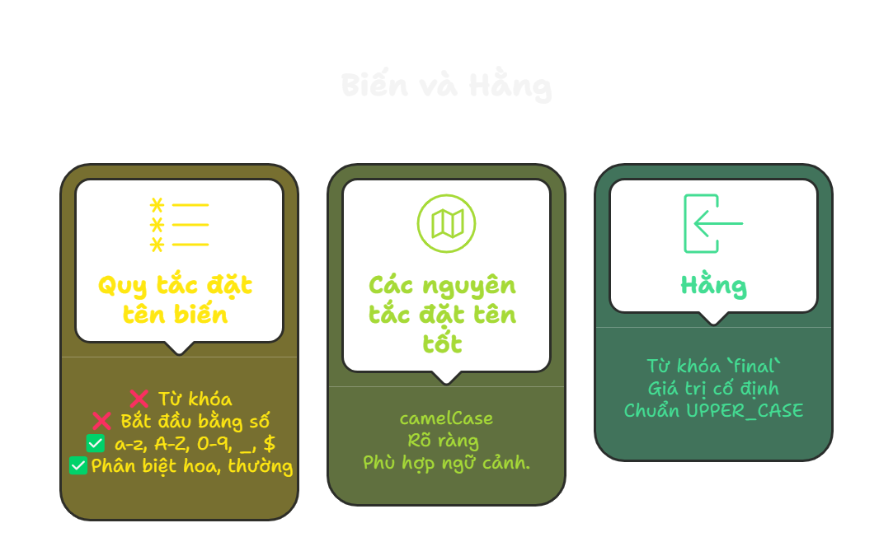

# Biến và hằng trong Java

## Tổng quan bài học
- Hiểu khái niệm, các cách khai báo và sử dụng hiệu quả biến và hằng.

## Nội dung bài học

### Mục lục
**1. Biến**

**2. Hằng**

**3. Tổng hợp những điểm cần nhớ**

**4. Bài tập**


## 1. Biến
- Biến: Tên định danh đại diện cho một vùng nhớ
- Biến: Giúp lưu trữ các giá trị có thể thay đổi

### Quy tắc đặt tên biến


### Đặt tên biến hiệu quả


```java
// Ví dụ hợp lệ
int age = 25;
double saralyRate = 1.0;
String fullName;

// Hợp lệ nhưng không khuyến khích
String first_name = "John"; 
String $salary = "5000";

// Ví dụ không hợp lệ
int 2days;    // Không được bắt đầu bằng số
int first-name = "Anh"; // Không được chứa ký tự "-"
```

### **Bảng Từ Khóa Trong Java**

| **Nhóm**                     | **Từ khóa**                                                                 |
|------------------------------|----------------------------------------------------------------------------|
| **Kiểu dữ liệu (Data Types)** | `byte`, `short`, `int`, `long`, `float`, `double`, `char`, `boolean`      |
| **Điều kiện & Vòng lặp**      | `if`, `else`, `switch`, `case`, `default`, `while`, `do`, `for`, `break`, `continue` |
| **Xử lý ngoại lệ**            | `try`, `catch`, `finally`, `throw`, `throws`                              |
| **Lập trình hướng đối tượng** | `class`, `interface`, `extends`, `implements`, `this`, `super`            |
| **Truy cập & Phạm vi**        | `public`, `private`, `protected`, `static`, `final`, `abstract`, `synchronized`, `transient`, `volatile` |
| **Đa luồng (Concurrency)**    | `synchronized`, `volatile`                                                |
| **Gán giá trị & Tham chiếu**  | `new`, `return`, `instanceof`                                             |
| **Bộ nhớ & Garbage Collection** | `null`, `super`, `this`, `new`                                           |
| **Từ khóa đặc biệt**          | `import`, `package`, `native`, `strictfp`, `assert`, `default`            |
| **Từ khóa bị loại bỏ**        | `goto`, `const` (Không sử dụng trong Java)                              |

## 2. Hằng
- Hằng là biến có giá trị **không thể** thay đổi sau khi gán
- Biểu diễn các giá trị cố định
- Giúp source code dễ đọc và bảo trì hơn, tránh các thay đổi không mong muốn.

### Cách khai báo và sử dụng hằng
- `final`
- Tên hằng: Chuẩn UPPER_CASE

**Ví dụ:**
```java
final double PI = 3.14159;
final int MAX_USERS = 100;
```

### Lưu ý khi sử dụng hằng
- Khai báo hằng với `final`, gán giá trị ngay khi khai báo
- Đặt tên hằng theo chuẩn UPPER_CASE
- **Không thể** gán lại giá trị

## 3. Tổng hợp những điểm cần nhớ


---

## 4. Bài tập

### Bài tập trắc nghiệm
**Câu 1:** Trong Java, từ khóa nào được sử dụng để khai báo một hằng số?
   - A. `static`
   - B. `final`
   - C. `const`
   - D. `volatile`

**Câu 2:** Đâu là tên biến hợp lệ trong Java?
   - A. `2days`
   - B. `first-name`
   - C. `age`
   - D. `first name`

**Câu 3:** Đâu là cách khai báo hằng số đúng trong Java?
   - A. `final int MAX_USERS = 100;`
   - B. `int final MAX_USERS = 100;`
   - C. `final MAX_USERS = 100;`
   - D. `int MAX_USERS = final 100;`

**Câu 4:** Đâu là tên hằng số tốt trong Java?
   - A. `maxUsers`
   - B. `MAX_USERS`
   - C. `MaxUsers`
   - D. `max_users`

**Câu 5:** Đâu là cách khai báo biến hợp lệ trong Java?
   - A. `int 2days;`
   - B. `int first-name;`
   - C. `int age = 25;`
   - D. `String last name = "Nguyen";`


### Bài tập thực hành
**Bài 1:** Giải thích sự khác biệt giữa biến và hằng trong Java. Cho ví dụ minh họa.

**Bài 2:** Viết một chương trình Java đơn giản để khai báo các biến lưu trữ thông tin cá nhân (tên, tuổi, chiều cao).

**Bài 3:** Tại sao việc đặt tên biến và hằng số một cách có ý nghĩa lại quan trọng trong lập trình? Cho ví dụ.

**Bài 4:** Liệt kê và giải thích các quy tắc đặt tên biến trong Java.

**Bài 5:** Viết một đoạn mã Java để khai báo một hằng số `PI` với giá trị 3.14159 và sử dụng nó để tính diện tích của một hình tròn.

**Bài 6:** Giải thích ý nghĩa của từ khóa `final` trong Java. Cho ví dụ minh họa.