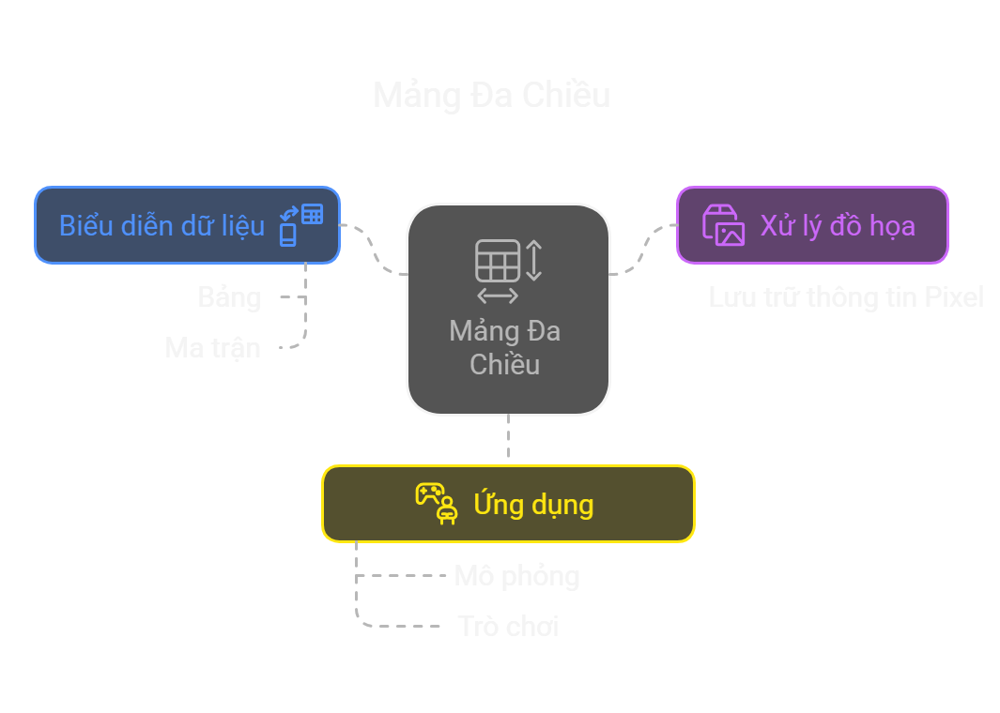

# Array

## Tổng quan bài học

- Giới thiệu và cách sử dụng sử dụng Array hiệu quả

## Nội dung bài học

**1.1 Giới thiệu**

**1.2 Cú pháp khai báo và khởi tạo mảng**

**1.3 Truy cập phần tử trong mảng**

**1.4 Duyệt qua các phần tử**

**1.5 Mảng đa chiều (mảng trong mảng)**

**1.6 Các phương thức phổ biến**

**2. Các thực hành tốt nhất**

**3. Bài tập**


## 1.1 Giới thiệu
- Là **tập hợp các phần tử có cùng kiểu dữ liệu**, được lưu trữ liên tiếp trong bộ nhớ.  
- Giúp quản lý nhiều giá trị dưới **một tên biến duy nhất**.  
- Có **kích thước cố định** sau khi khởi tạo.

## 1.2 Cú pháp khai báo và khởi tạo mảng
### Cách 1: Khai báo và khởi tạo ngay lập tức
```java
int[] numbers = {10, 20, 30, 40, 50};
```

### Cách 2: Khai báo trước, khởi tạo sau
```java
int[] numbers;        // Khai báo
numbers = new int[5]; // Cấp phát bộ nhớ cho 5 phần tử
```

### Cách 3: Sử dụng new với giá trị khởi tạo
```java
int[] numbers = new int[]{10, 20, 30, 40, 50};
```

## 1.3 Truy cập phần tử trong mảng
```java
int[] numbers = {10, 20, 30, 40, 50};
System.out.println(numbers[0]); // Output: 10
System.out.println(numbers[2]); // Output: 30
System.out.println(numbers[5]); // ❌ Lỗi ArrayIndexOutOfBoundsException - index hợp lệ: 0-4
```

## 1.4 Duyệt qua các phần tử
### Cách 1: Dùng vòng lặp for (cách truyền thống)
- index bắt đầu từ 0
```java
for (int i = 0; i < numbers.length; i++) {
    System.out.println("Number: " + numbers[i]);
}
```

### Cách 2: Dùng vòng lặp for-each (cách hiện đại, dễ đọc hơn)
```java
for (int number : numbers) {
    System.out.println("Number: " + number);
}
```

## 1.5 Mảng đa chiều (mảng trong mảng)

```java
public class TwoDimensionalArrayExample {
    public static void main(String[] args) {
        int[][] matrix = new int[3][3]; // Khai báo và khởi tạo mảng hai chiều

        // Gán giá trị cho mảng
        matrix[0][0] = 1;
        matrix[0][1] = 2;
        matrix[0][2] = 3;
        matrix[1][0] = 4;
        matrix[1][1] = 5;
        matrix[1][2] = 6;
        matrix[2][0] = 7;
        matrix[2][1] = 8;
        matrix[2][2] = 9;

        // Duyệt qua các phần tử
        for (int i = 0; i < matrix.length; i++) {
            for (int j = 0; j < matrix[i].length; j++) {
                System.out.print(matrix[i][j] + " ");
            }
            System.out.println(); // Xuống dòng sau mỗi hàng
        }
    }
}
```

## 1.6 Các phương thức phổ biến

| Phương thức | Mô tả | Ví dụ |
|------------|-------|-------|
| `Arrays.toString(array)` | Chuyển mảng thành chuỗi dạng `[a, b, c]` | `System.out.println(Arrays.toString(arr));` |
| `Arrays.sort(array)` | Sắp xếp mảng tăng dần | `Arrays.sort(arr);` |
| `Arrays.fill(array, value)` | Gán tất cả phần tử trong mảng bằng một giá trị | `Arrays.fill(arr, 0);` |
| `Arrays.copyOf(array, length)` | Sao chép mảng với độ dài mới | `int[] newArr = Arrays.copyOf(arr, 5);` |
| `Arrays.copyOfRange(array, start, end)` | Sao chép một phần mảng từ `start` đến `end-1` | `int[] subArr = Arrays.copyOfRange(arr, 1, 4);` |
| `Arrays.equals(arr1, arr2)` | So sánh hai mảng có bằng nhau không | `boolean isEqual = Arrays.equals(arr1, arr2);` |
| `Arrays.binarySearch(array, value)` | Tìm kiếm nhị phân (yêu cầu mảng đã sắp xếp) | `int index = Arrays.binarySearch(arr, 5);` |
| `Arrays.asList(array)` | Chuyển mảng thành danh sách `List<T>` | `List<Integer> list = Arrays.asList(arr);` |
| `System.arraycopy(src, srcPos, dest, destPos, length)` | Sao chép một phần mảng này sang mảng khác | `System.arraycopy(arr1, 0, arr2, 2, 3);` |
 

## 2. Các thực hành tốt nhất
### Sử dụng `Arrays.toString()` để in mảng một cách hiệu quả
```java
import java.util.Arrays;
public class ArraySample {
    public static void main(String[] args) {
        int[] arr = {1, 2, 3, 4};
        System.out.println(arr); // In ra địa chỉ bộ nhớ, không phải nội dung mảng
        System.out.println(Arrays.toString(arr)); // Kết quả: [1, 2, 3, 4]
    }
}
```

### Tránh sử dụng length trong vòng lặp nếu không cần thiết
```java
// Sai cách: Giảm hiệu suất
for (int i = 0; i < arr.length; i++) {  // `length` gọi lại mỗi lần lặp
    System.out.println(arr[i]);
}

// Đúng cách
int n = arr.length;
for (int i = 0; i < n; i++) {  // Lưu `length` vào biến giúp tối ưu hiệu suất
    System.out.println(arr[i]);
}
// Đúng cách - dùng for-each
for (int num : arr) {
    System.out.println(num);
}
```

### Sử dụng Arrays.fill() để khởi tạo nhanh mảng
```java
// Sai cách
int[] arr = new int[5];
for (int i = 0; i < arr.length; i++) {
    arr[i] = -1;
}

// Đúng cách
import java.util.Arrays;

int[] arr = new int[5];
Arrays.fill(arr, -1); // Nhanh hơn và ngắn gọn hơn
```

### Luôn kiểm tra kích thước mảng trước khi truy cập phần tử, tránh `ArrayIndexOutOfBoundsException`
```java
// Sai cách
int[] arr = new int[0];
System.out.println(arr[0]); // Lỗi: ArrayIndexOutOfBoundsException

// Đúng cách
if (arr.length > 0) {
    System.out.println(arr[0]);
} else {
    System.out.println("Mảng rỗng!");
}
```

### Sử dụng Arrays.copyOf() thay vì sao chép thủ công
Để sao chép hoặc thay đổi kích thước mảng, dùng Arrays.copyOf() thay vì vòng lặp.
```java
// Sai cách
int[] arr = {1, 2, 3};
int[] newArr = new int[5];
for (int i = 0; i < arr.length; i++) {
    newArr[i] = arr[i];
}

// Đúng cách
import java.util.Arrays;

int[] arr = {1, 2, 3};
int[] newArr = Arrays.copyOf(arr, 5); // {1, 2, 3, 0, 0}

```

## 3. Câu hỏi và bài tập

## 3.1. 10 câu hỏi trắc nghiệm
**Câu 1:** Mảng trong Java có đặc điểm nào sau đây?  
- A. Có thể thay đổi kích thước sau khi khởi tạo  
- B. Lưu trữ các phần tử có kiểu dữ liệu khác nhau  
- C. Kích thước cố định sau khi khởi tạo  
- D. Không thể chứa các giá trị trùng lặp  

**Câu 2:** Chỉ số (index) của phần tử đầu tiên trong mảng Java là bao nhiêu?  
- A. -1  
- B. 0  
- C. 1  
- D. Không xác định  

**Câu 3:** Lệnh nào dưới đây dùng để khai báo và khởi tạo một mảng số nguyên có 5 phần tử trong Java?  
- A. `int arr = new int(5);`  
- B. `int arr[5] = new int[];`  
- C. `int[] arr = new int[5];`  
- D. `int arr[] = {5};`  


**Câu 4:** Làm cách nào để in tất cả phần tử của mảng `int[] arr = {1, 2, 3, 4, 5};` một cách chính xác?  
- A. `System.out.println(arr);`  
- B. `System.out.println(Arrays.toString(arr));`  
- C. `System.out.println(arr.toString());`  
- D. `System.out.println(arr[]);`  

**Câu 5:** Kết quả của đoạn mã sau là gì?  
```java
int[] arr = {10, 20, 30, 40, 50};
System.out.println(arr[2]);
```
- A. 10
- B. 20
- C. 30
- D. 40

**Câu 6:** Điều gì xảy ra khi truy cập `arr[10]` trong mảng `int[] arr = new int[5];`?  
- A. Trả về `0`  
- B. Trả về `null`  
- C. Lỗi `ArrayIndexOutOfBoundsException`  
- D. Không có lỗi nhưng giá trị không xác định  

**Câu 7:** Lệnh nào dưới đây dùng để sao chép mảng trong Java một cách chính xác?  
- A. `int[] newArr = arr;`  
- B. `int[] newArr = Arrays.copyOf(arr, arr.length);`  
- C. `int[] newArr = arr.clone();`  
- D. Cả B và C đúng  

**Câu 8:** Lệnh nào sau đây sẽ sắp xếp mảng `int[] arr = {5, 3, 8, 1, 2};` theo thứ tự tăng dần?  
- A. `sort(arr);`  
- B. `Collections.sort(arr);`  
- C. `Arrays.sort(arr);`  
- D. `arr.sort();`  

**Câu 9:** Phương thức nào dùng để tìm kiếm phần tử trong mảng đã sắp xếp?
- A. `Arrays.find()`  
- B. `Arrays.lookup()`  
- C. `Arrays.search()`  
- D. `Arrays.binarySearch()`  

**Câu 10:** Điều gì xảy ra nếu so sánh hai mảng `int[] arr1 = {1, 2, 3};` và `int[] arr2 = {1, 2, 3};` bằng `arr1 == arr2`?  
- A. Trả về `true` nếu nội dung giống nhau  
- B. Trả về `false` vì chúng là hai đối tượng khác nhau  
- C. Lỗi biên dịch  
- D. Chương trình dừng đột ngột  

### 4.2. Bài tập thực hành
**Câu 1:** Tìm số lớn nhất trong mảng  
Viết một phương thức Java để tìm số lớn nhất trong một mảng số nguyên.  

**Câu 2:** Đảo ngược mảng  
Viết một chương trình Java để đảo ngược thứ tự các phần tử trong mảng.  

**Câu 3:** Tính tổng các phần tử trong mảng  
Viết một chương trình Java để tính tổng tất cả các phần tử trong một mảng số nguyên.  

**Câu 4:** Kiểm tra phần tử có trong mảng không  
Viết một phương thức Java để kiểm tra xem một số có tồn tại trong mảng hay không.  

**Câu 5:** Đếm số lần xuất hiện của phần tử trong mảng  
Viết một chương trình Java để đếm số lần xuất hiện của một phần tử trong mảng.  
